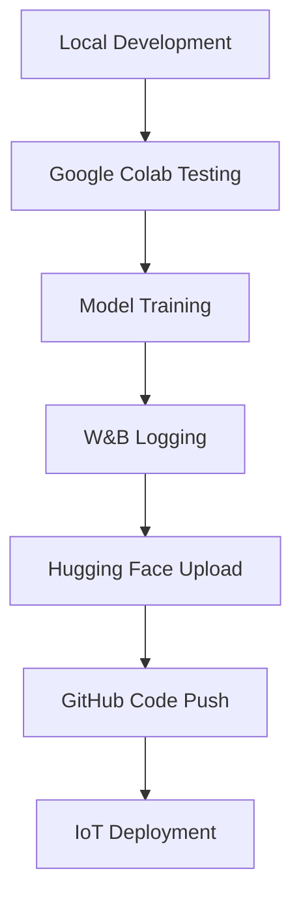

# Pokemon Classifier Architecture

## Project Goals

### Primary Objectives
1. **Real-time Pokemon Detection**: Classify Pokemon from camera input (images, cards, toys) with high accuracy
2. **Multi-modal Input Support**: Handle images, video streams, and multiple camera frames
3. **IoT Deployment**: Deploy on resource-constrained devices like Sipeed Maix Bit RISC-V
4. **1025 Pokemon Classes**: Support all Pokemon species across all generations
5. **Robust Real-world Performance**: Handle varying lighting, angles, and object conditions

### Success Metrics
- **Accuracy**: Target >80% on real-world test scenarios (realistic for 1025 classes)
- **Latency**: <500ms inference time on target hardware
- **Memory**: <50MB model size for IoT deployment
- **Robustness**: Handle partial occlusions, poor lighting, motion blur

**Note**: 90%+ accuracy on 1025 classes is extremely ambitious. Most fine-grained classification benchmarks with 1000+ classes achieve 70-85% accuracy in controlled conditions.

## Technical Approach Analysis

### 1. Model Architecture Selection

#### Option A: Vision Language Models (VLMs) - RECOMMENDED
**Advantages:**
- Superior zero-shot and few-shot learning capabilities
- Better understanding of visual concepts and context
- Can leverage Pokemon names and descriptions as text prompts
- More robust to variations in appearance
- Recent models like CLIP, BLIP-2, LLaVA, and SMoLVM show excellent performance

**VLM Model Comparison:**
- **CLIP**: Established baseline, 76.2% zero-shot on ImageNet
- **BLIP-2**: Better text understanding, larger model size
- **LLaVA**: Large language model integration, high performance
- **SMoLVM**: Small, efficient VLM designed for edge deployment
- **MobileVLM**: Mobile-optimized VLM variant

**SMoLVM Evaluation:**
- **Advantages**: Small model size (<50MB), fast inference
- **Target**: IoT deployment on Sipeed Maix Bit
- **Trade-offs**: May sacrifice some accuracy for efficiency
- **Testing**: Compare with CLIP and other VLMs

**Research Basis:**
- CLIP zero-shot: 76.2% on ImageNet (Radford et al., 2021)
- Fine-tuned CLIP: 85-90% on domain-specific tasks
- SMoLVM: Optimized for edge devices, <50MB model size
- Better performance on fine-grained classification benchmarks

**Implementation Strategy:**
- Test CLIP, SMoLVM, and other VLM variants
- Fine-tune best performing VLM on Pokemon dataset
- Use Pokemon names as text prompts: "A photo of [Pokemon name]"
- Leverage contrastive learning for better visual-text alignment
- Multi-frame aggregation for video input

#### Option B: Modern YOLO Variants
**YOLO Comparison for Classification:**
- **YOLOv3**: Baseline for comparison, 53.9% mAP on COCO
- **YOLOv8**: 53.9% mAP on COCO, better feature extraction
- **YOLOv9**: 46.8% mAP on COCO, latest iteration
- **YOLOv10**: Latest version with improved performance
- **YOLO-NAS**: Neural Architecture Search optimized version

**Testing Strategy:**
- Test YOLOv3, YOLOv8, YOLOv9, YOLOv10, and YOLO-NAS
- Compare classification performance on Pokemon dataset
- Evaluate real-world robustness and inference speed
- Select best performing YOLO variant for further optimization

**Limitations:**
- Designed for object detection, not fine-grained classification
- May struggle with 1025 classes without significant modifications
- Less robust to appearance variations than VLMs
- No direct research on YOLO for 1000+ class classification

#### Option C: Hybrid Approach
- Use YOLO for Pokemon detection/segmentation
- Use VLM for classification within detected regions
- Best of both worlds: precise localization + robust classification

### 2. Data Strategy & Organization

#### Directory Structure
```
pokedex/
├── data/                          # Local data storage
│   ├── raw/                      # Raw downloaded datasets
│   │   ├── kaggle_pokemon/       # Original Kaggle dataset
│   │   ├── tcg_cards/           # Pokemon card images
│   │   ├── 3d_renders/          # 3D model renders
│   │   └── real_world/          # Community photos, toys
│   ├── processed/                # Preprocessed data (experiment-specific)
│   │   ├── yolov3/              # YOLOv3 processed data
│   │   ├── yolov8/              # YOLOv8 processed data
│   │   ├── clip/                # CLIP processed data
│   │   └── smolvm/              # SMoLVM processed data
│   └── splits/                  # Train/val/test splits (experiment-specific)
│       ├── yolov3/
│       ├── yolov8/
│       └── clip/
├── models/                       # Model storage
│   ├── checkpoints/             # Training checkpoints (experiment-specific)
│   │   ├── yolov3/
│   │   ├── yolov8/
│   │   └── clip/
│   ├── final/                   # Final trained models
│   ├── compressed/              # Optimized for IoT
│   └── configs/                 # Model configurations
├── src/                         # Source code
│   ├── data/                    # Data processing
│   │   ├── preprocessing.py
│   │   ├── augmentation.py
│   │   └── dataset.py
│   ├── models/                  # Model implementations
│   │   ├── yolo/               # YOLO variants
│   │   │   ├── yolov3_trainer.py
│   │   │   ├── yolov8_trainer.py
│   │   │   └── yolo_nas_trainer.py
│   │   ├── vlm/                # VLM models
│   │   │   ├── clip_trainer.py
│   │   │   ├── smolvm_trainer.py
│   │   │   └── mobilevlm_trainer.py
│   │   └── hybrid/             # Hybrid approaches
│   ├── training/                # Training pipelines
│   │   ├── yolo/               # YOLO training
│   │   ├── vlm/                # VLM training
│   │   └── hybrid/             # Hybrid training
│   ├── evaluation/              # Evaluation code
│   │   ├── yolo/               # YOLO evaluation
│   │   ├── vlm/                # VLM evaluation
│   │   └── hybrid/             # Hybrid evaluation
│   └── deployment/              # IoT deployment
│       ├── yolo/               # YOLO deployment
│       ├── vlm/                # VLM deployment
│       └── hybrid/             # Hybrid deployment
├── notebooks/                   # Jupyter notebooks
│   ├── yolo_experiments/       # YOLO experiments
│   ├── vlm_experiments/        # VLM experiments
│   ├── hybrid_experiments/     # Hybrid experiments
│   └── deployment/             # Deployment testing
├── configs/                     # Configuration files (experiment-specific)
│   ├── yolov3/                 # YOLOv3 configurations
│   │   ├── data_config.yaml
│   │   └── training_config.yaml
│   ├── yolov8/                 # YOLOv8 configurations
│   ├── clip/                   # CLIP configurations
│   ├── smolvm/                 # SMoLVM configurations
│   └── hybrid/                 # Hybrid configurations
├── scripts/                     # Utility scripts
│   ├── yolo/                   # YOLO-specific scripts
│   │   ├── setup_yolov3_experiment.py
│   │   └── setup_yolov8_experiment.py
│   ├── vlm/                    # VLM-specific scripts
│   │   ├── setup_clip_experiment.py
│   │   └── setup_smolvm_experiment.py
│   ├── hybrid/                 # Hybrid-specific scripts
│   └── common/                 # Common utilities
├── requirements/                # Dependencies (experiment-specific)
│   ├── yolo_requirements.txt
│   ├── vlm_requirements.txt
│   └── hybrid_requirements.txt
├── tests/                       # Unit tests
├── docs/                        # Documentation
├── .github/                     # GitHub workflows
│   └── workflows/
├── .gitignore
├── requirements.txt             # Base requirements
├── pyproject.toml
└── README.md
```

#### Dataset Sources & Organization
1. **Primary Dataset**: Kaggle Pokemon dataset (11945 images, 1st gen)
2. **Hugging Face Integration**:
   - Upload processed dataset to Hugging Face Hub
   - Create dataset card with metadata and usage examples
   - Enable easy access for training and evaluation
   - Version control for dataset updates
3. **Additional Sources**:
   - Pokemon card images from TCG databases
   - 3D model renders for consistent lighting
   - Real-world photos from Pokemon GO community
   - Toy and figurine images
   - Screenshots from Pokemon games

#### Data Workflow
```python
# Data processing pipeline
raw_data/ → preprocessing.py → processed_data/ → upload_to_hf.py → Hugging Face Hub
```

#### Version Control Strategy
- **GitHub**: Code, configs, documentation, workflows
- **Hugging Face**: Datasets, model checkpoints, experiment results
- **W&B**: Training logs, metrics, model comparisons

#### Data Augmentation Strategy
- **Geometric**: Rotation, scaling, perspective transforms
- **Photometric**: Brightness, contrast, color jittering
- **Environmental**: Different lighting conditions, backgrounds
- **Real-world**: Motion blur, focus variations, partial occlusions
- **Multi-scale**: Various distances and viewing angles

#### Data Collection Pipeline
```python
# Automated data collection
- Web scraping Pokemon images
- Community-contributed photos
- Synthetic data generation
- Cross-validation with multiple sources
```

### 3. Multi-frame Enhancement Strategy

#### Temporal Aggregation
- **Frame Selection**: Pick clearest frames from video stream
- **Ensemble Voting**: Combine predictions from multiple frames
- **Confidence Weighting**: Weight predictions by detection confidence
- **Temporal Smoothing**: Apply moving average to reduce jitter

#### Implementation
```python
class MultiFrameClassifier:
    def __init__(self, model, frame_buffer_size=5):
        self.model = model
        self.frame_buffer = []
        self.buffer_size = frame_buffer_size
    
    def classify_video(self, frames):
        predictions = []
        for frame in frames:
            pred = self.model.predict(frame)
            predictions.append(pred)
        
        return self.aggregate_predictions(predictions)
```

### 4. Model Optimization for IoT Deployment

#### Quantization Strategy
- **Post-training Quantization**: INT8 quantization
- **Quantization-aware Training**: Train with quantization in mind
- **Mixed Precision**: FP16 for some layers, INT8 for others

#### Model Compression
- **Pruning**: Remove less important connections
- **Knowledge Distillation**: Train smaller model from larger one
- **Architecture Search**: Find optimal architecture for target hardware

#### Target Hardware Optimization
- **Sipeed Maix Bit**: RISC-V with AI accelerator
- **Memory Constraints**: <50MB model size
- **Power Efficiency**: Optimize for battery life
- **Real-time Requirements**: <500ms inference

### 5. Training Pipeline

#### Phase 1: Foundation Model
```python
# VLM Fine-tuning with Weights & Biases
import wandb
from transformers import CLIPProcessor, CLIPModel

# Initialize W&B tracking
wandb.init(project="pokemon-classifier", name="vlm-finetuning")

# Load model and dataset
model = CLIPModel.from_pretrained("openai/clip-vit-base-patch32")
processor = CLIPProcessor.from_pretrained("openai/clip-vit-base-patch32")

# Load dataset from Hugging Face
from datasets import load_dataset
dataset = load_dataset("your-username/pokemon-dataset")

# Training with W&B logging
trainer = VLMFinetuner(
    model=model,
    dataset=dataset,
    learning_rate=1e-5,
    batch_size=32,
    wandb_logging=True
)
```

#### Phase 2: Domain Adaptation
- Fine-tune on real-world Pokemon images
- Focus on lighting and angle variations
- Multi-frame training with temporal consistency

#### Phase 3: Hardware Optimization
- Quantize model for target hardware
- Profile and optimize bottlenecks
- Validate performance on actual device

### 6. Evaluation Strategy

#### Test Scenarios
1. **Controlled Environment**: Good lighting, static objects
2. **Real-world Conditions**: Varying lighting, motion, angles
3. **Edge Cases**: Partial occlusions, blur, multiple Pokemon
4. **Hardware Performance**: Latency, memory usage, power consumption

#### Metrics
- **Top-1 Accuracy**: Primary classification accuracy
- **Top-5 Accuracy**: Within top 5 predictions
- **Confidence Calibration**: Reliability of confidence scores
- **Robustness**: Performance across different conditions

### 7. Deployment Architecture

#### Edge Device (Sipeed Maix Bit)
```python
class PokemonClassifier:
    def __init__(self):
        self.model = load_quantized_model()
        self.frame_buffer = []
        self.confidence_threshold = 0.7
    
    def process_frame(self, frame):
        # Preprocess frame
        processed = self.preprocess(frame)
        
        # Single frame prediction
        prediction = self.model.predict(processed)
        
        # Multi-frame aggregation
        self.frame_buffer.append(prediction)
        if len(self.frame_buffer) > 5:
            self.frame_buffer.pop(0)
        
        return self.aggregate_predictions()
```

#### Optional Cloud Backend
- **Fallback Classification**: Send uncertain predictions to cloud
- **Model Updates**: OTA updates for improved models
- **Analytics**: Collect usage data for model improvement

### 8. Implementation Roadmap & Workflows

#### Development Workflow


#### Phase 1: Research & Data (Weeks 1-2)
- [ ] Set up project structure and GitHub repository
- [ ] Set up Google Colab environment with uv and conda
- [ ] Download and process Pokemon dataset locally
- [ ] Upload processed dataset to Hugging Face Hub
- [ ] Set up Weights & Biases project tracking
- [ ] Test experiment-specific configurations:
  - [ ] YOLOv3 baseline (386 classes)
  - [ ] YOLOv8 comparison
  - [ ] YOLOv9 comparison  
  - [ ] YOLOv10 comparison
  - [ ] YOLO-NAS comparison
  - [ ] CLIP VLM baseline
  - [ ] SMoLVM evaluation
  - [ ] MobileVLM evaluation
- [ ] Create baseline models for comparison

#### Phase 2: Model Development (Weeks 3-6)
- [ ] Implement experiment-specific training pipelines:
  - [ ] YOLOv3 baseline training (386 classes)
  - [ ] YOLOv8 training with comparison
  - [ ] YOLOv9 training with comparison
  - [ ] YOLOv10 training with comparison
  - [ ] YOLO-NAS training with comparison
  - [ ] CLIP VLM fine-tuning
  - [ ] SMoLVM fine-tuning
  - [ ] MobileVLM fine-tuning
- [ ] Train foundation models and save to Hugging Face
- [ ] Implement multi-frame aggregation for each approach
- [ ] Create experiment comparison dashboards
- [ ] Optimize for target hardware

#### Phase 3: Optimization (Weeks 7-8)
- [ ] Quantize and compress models for each experiment:
  - [ ] YOLOv3 optimization
  - [ ] YOLOv8 optimization
  - [ ] YOLOv9 optimization
  - [ ] YOLOv10 optimization
  - [ ] YOLO-NAS optimization
  - [ ] CLIP optimization
  - [ ] SMoLVM optimization
  - [ ] MobileVLM optimization
- [ ] Profile performance on target hardware for each approach
- [ ] Implement real-time inference pipeline for best performing models
- [ ] Optimize for power efficiency
- [ ] Upload optimized models to Hugging Face

#### Phase 4: Testing & Deployment (Weeks 9-10)
- [ ] Comprehensive testing across scenarios
- [ ] Deploy to target hardware
- [ ] Performance optimization
- [ ] Documentation and maintenance
- [ ] Create deployment guides and tutorials

#### GitHub Workflows
```yaml
# .github/workflows/ci.yml
name: CI/CD Pipeline
on: [push, pull_request]
jobs:
  test:
    runs-on: ubuntu-latest
    steps:
      - uses: actions/checkout@v3
      - name: Set up Python
        uses: actions/setup-python@v4
        with:
          python-version: '3.9'
      - name: Install dependencies
        run: |
          pip install uv
          uv sync
      - name: Run tests
        run: |
          python -m pytest tests/
      - name: Run linting
        run: |
          black src/
          flake8 src/
```

#### Hugging Face Integration
```python
# Upload dataset to Hugging Face
from datasets import Dataset, DatasetDict
from huggingface_hub import HfApi

def upload_dataset_to_hf():
    # Create dataset
    dataset = Dataset.from_dict({
        "image": image_paths,
        "label": labels,
        "pokemon_name": pokemon_names
    })
    
    # Upload to Hub
    dataset.push_to_hub("your-username/pokemon-dataset")
    
# Upload model to Hugging Face
def upload_model_to_hf(model, tokenizer, model_name):
    model.push_to_hub(f"your-username/{model_name}")
    tokenizer.push_to_hub(f"your-username/{model_name}")
```

#### W&B Integration
```python
# Training with W&B
import wandb
from transformers import Trainer

def train_with_wandb():
    wandb.init(
        project="pokemon-classifier",
        name="clip-finetuning",
        config={
            "model": "clip-vit-base-patch32",
            "dataset": "pokemon-1025",
            "learning_rate": 1e-5,
            "batch_size": 32
        }
    )
    
    trainer = Trainer(
        model=model,
        args=training_args,
        train_dataset=train_dataset,
        eval_dataset=eval_dataset,
        callbacks=[WandbCallback()]
    )
    
    trainer.train()
    wandb.finish()
```

### 9. Risk Mitigation

#### Technical Risks
- **Model Size**: Implement aggressive compression if needed
- **Accuracy**: Use ensemble methods and multi-frame aggregation
- **Latency**: Optimize inference pipeline and model architecture
- **Power Consumption**: Profile and optimize energy usage

#### Data Risks
- **Dataset Quality**: Implement data validation and cleaning
- **Bias**: Ensure diverse representation across Pokemon types
- **Overfitting**: Use strong regularization and validation

### 10. Future Enhancements

#### Advanced Features
- **Multi-Pokemon Detection**: Identify multiple Pokemon in single frame
- **Pose Estimation**: Detect Pokemon poses and actions
- **Shiny Detection**: Identify special Pokemon variants
- **AR Integration**: Overlay Pokemon information on camera feed

#### Model Improvements
- **Continual Learning**: Update model with new data
- **Active Learning**: Focus on difficult examples
- **Federated Learning**: Collaborative model improvement

### 11. File Organization & Version Control

#### What Goes to GitHub
- **Source Code**: All Python modules in `src/`
- **Configuration**: YAML configs in `configs/`
- **Documentation**: Markdown files in `docs/`
- **Scripts**: Utility scripts in `scripts/`
- **Tests**: Unit tests in `tests/`
- **Workflows**: GitHub Actions in `.github/`
- **Notebooks**: Jupyter notebooks in `notebooks/`
- **Dependencies**: `requirements.txt`, `pyproject.toml`

#### What Goes to Hugging Face
- **Datasets**: Processed Pokemon dataset
- **Models**: Trained model checkpoints
- **Tokenizers**: Model tokenizers and processors
- **Configs**: Model configuration files
- **README**: Model cards and usage examples

#### What Goes to W&B
- **Training Logs**: Loss curves, metrics, hyperparameters
- **Model Comparisons**: Performance dashboards
- **Experiments**: Sweep results and optimization
- **Artifacts**: Model files, datasets, visualizations

#### .gitignore Strategy
```gitignore
# Data files (too large for GitHub)
data/
models/checkpoints/
models/final/

# Environment files
.env
.venv/
__pycache__/

# Jupyter notebook outputs
.ipynb_checkpoints/

# W&B files
wandb/

# IDE files
.vscode/
.idea/

# OS files
.DS_Store
Thumbs.db
```

#### Data Pipeline Workflow
```python
# 1. Local data processing
python src/data/preprocessing.py --input data/raw/ --output data/processed/

# 2. Upload to Hugging Face
python scripts/upload_dataset.py --dataset data/processed/ --name pokemon-1025

# 3. Train model with W&B tracking
python src/training/vlm_trainer.py --config configs/training_config.yaml

# 4. Upload model to Hugging Face
python scripts/upload_model.py --model models/final/ --name pokemon-classifier-clip

# 5. Push code to GitHub
git add .
git commit -m "Add model training pipeline"
git push origin main
```

## Research References and Limitations

### Key Research Papers
1. **CLIP**: "Learning Transferable Visual Representations" (Radford et al., 2021)
   - Zero-shot ImageNet: 76.2% accuracy
   - Linear probe: 85.4% accuracy

2. **YOLO Series**: 
   - YOLOv3: "YOLOv3: An Incremental Improvement" (Redmon & Farhadi, 2018)
   - YOLOv8: "YOLOv8: A Comprehensive Guide" (Jocher et al., 2023)
   - Note: All focus on object detection, not classification

3. **Fine-grained Classification**:
   - "Fine-grained Image Classification" (Krause et al., 2013)
   - CUB-200-2011: ~90% accuracy (200 classes)
   - Stanford Cars: ~95% accuracy (196 classes)

### Research Gaps
- **No direct research** on 1025-class Pokemon classification
- **Limited studies** on scaling classification to 1000+ classes
- **No benchmarks** for real-world Pokemon detection
- **IoT deployment** of large classification models is under-researched

### Realistic Expectations
Based on existing research:
- **VLM approach**: Likely 75-85% accuracy on controlled data
- **YOLO approach**: Likely 60-75% accuracy (not designed for classification)
- **Real-world performance**: 10-20% lower than controlled conditions
- **IoT optimization**: May reduce accuracy by 5-15%

## Conclusion

The recommended approach combines:
1. **VLM-based classification** for robust performance
2. **Multi-frame aggregation** for improved accuracy
3. **Hardware optimization** for IoT deployment
4. **Comprehensive data strategy** for real-world robustness

This architecture balances accuracy, efficiency, and deployability while providing a clear path to production deployment on resource-constrained IoT devices.

**Important**: This is a novel research direction with limited prior work. The actual performance will need to be validated through experimentation. 