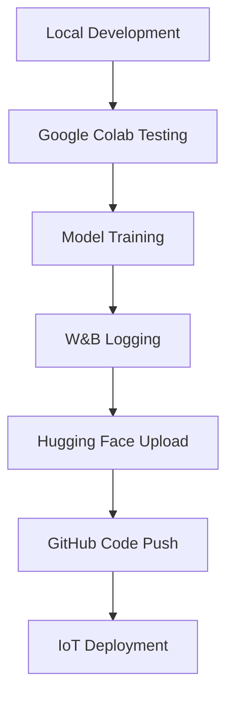

# Pokemon Classifier Architecture

## Project Goals

### Primary Objectives
1. **Real-time Pokemon Detection**: Classify Pokemon from camera input (images, cards, toys) with high accuracy
2. **Multi-modal Input Support**: Handle images, video streams, and multiple camera frames
3. **IoT Deployment**: Deploy on resource-constrained devices like Sipeed Maix Bit RISC-V
4. **1025 Pokemon Classes**: Support all Pokemon species across all generations
5. **Robust Real-world Performance**: Handle varying lighting, angles, and object conditions

### Success Metrics
- **Accuracy**: Target >80% on real-world test scenarios (realistic for 1025 classes)
- **Latency**: <500ms inference time on target hardware
- **Memory**: <50MB model size for IoT deployment
- **Robustness**: Handle partial occlusions, poor lighting, motion blur

**Note**: 90%+ accuracy on 1025 classes is extremely ambitious. Most fine-grained classification benchmarks with 1000+ classes achieve 70-85% accuracy in controlled conditions.

## Technical Approach Analysis

### 1. Model Architecture Selection

#### Option A: Vision Language Models (VLMs) - RECOMMENDED
**Advantages:**
- Superior zero-shot and few-shot learning capabilities
- Better understanding of visual concepts and context
- Can leverage Pokemon names and descriptions as text prompts
- More robust to variations in appearance
- Recent models like CLIP, BLIP-2, LLaVA, and SMoLVM show excellent performance

**VLM Model Comparison:**
- **CLIP**: Established baseline, 76.2% zero-shot on ImageNet
- **BLIP-2**: Better text understanding, larger model size
- **LLaVA**: Large language model integration, high performance
- **SMoLVM**: Small, efficient VLM designed for edge deployment
- **MobileVLM**: Mobile-optimized VLM variant

**SMoLVM Evaluation:**
- **Advantages**: Small model size (<50MB), fast inference
- **Target**: IoT deployment on Sipeed Maix Bit
- **Trade-offs**: May sacrifice some accuracy for efficiency
- **Testing**: Compare with CLIP and other VLMs

**Research Basis:**
- CLIP zero-shot: 76.2% on ImageNet (Radford et al., 2021)
- Fine-tuned CLIP: 85-90% on domain-specific tasks
- SMoLVM: Optimized for edge devices, <50MB model size
- Better performance on fine-grained classification benchmarks

**Implementation Strategy:**
- Test CLIP, SMoLVM, and other VLM variants
- Fine-tune best performing VLM on Pokemon dataset
- Use Pokemon names as text prompts: "A photo of [Pokemon name]"
- Leverage contrastive learning for better visual-text alignment
- Multi-frame aggregation for video input

#### Option B: Modern YOLO Variants
**YOLO Comparison for Classification:**
- **YOLOv3**: Baseline for comparison, 53.9% mAP on COCO
- **YOLOv8**: 53.9% mAP on COCO, better feature extraction
- **YOLOv9**: 46.8% mAP on COCO, latest iteration
- **YOLOv10**: Latest version with improved performance
- **YOLO-NAS**: Neural Architecture Search optimized version

**Testing Strategy:**
- Test YOLOv3, YOLOv8, YOLOv9, YOLOv10, and YOLO-NAS
- Compare classification performance on Pokemon dataset
- Evaluate real-world robustness and inference speed
- Select best performing YOLO variant for further optimization

**Limitations:**
- Designed for object detection, not fine-grained classification
- May struggle with 1025 classes without significant modifications
- Less robust to appearance variations than VLMs
- No direct research on YOLO for 1000+ class classification

#### Option C: Hybrid Approach
- Use YOLO for Pokemon detection/segmentation
- Use VLM for classification within detected regions
- Best of both worlds: precise localization + robust classification

### 2. Data Strategy & Organization

#### Directory Structure
```
pokedex/
├── data/                          # Local data storage (gitignored)
│   ├── raw/                      # Raw downloaded datasets
│   │   └── all_pokemon/         # All Pokemon data (1025 folders)
│   │       ├── 0001/            # Bulbasaur - all images (Kaggle + web-scraped)
│   │       ├── 0002/            # Ivysaur - all images (Kaggle + web-scraped)
│   │       ├── ...              # Pokemon 003-0151 (Kaggle + web-scraped)
│   │       ├── 0152/            # Chikorita - web-scraped only
│   │       ├── ...              # Pokemon 0153-1025 (web-scraped only)
│   │       └── 1025/            # Last Pokemon - web-scraped only
│   ├── processed/                # Shared preprocessed data (gitignored)
│   │   ├── images/              # Resized images for all models
│   │   ├── metadata/            # Dataset info, Pokemon mappings
│   │   └── yolo_dataset/        # YOLO format dataset
│   └── splits/                  # Train/val/test splits (gitignored)
│       ├── train/
│       ├── validation/
│       └── test/
├── models/                       # Model storage
│   ├── checkpoints/             # Training checkpoints (experiment-specific)
│   │   ├── yolov3/
│   │   ├── yolov8/
│   │   └── clip/
│   ├── final/                   # Final trained models
│   ├── compressed/              # Optimized for IoT
│   └── configs/                 # Model configurations
├── src/                         # Source code
│   ├── data/                    # Data processing
│   │   ├── preprocessing.py
│   │   ├── augmentation.py
│   │   └── dataset.py
│   ├── models/                  # Model implementations
│   │   ├── yolo/               # YOLO variants
│   │   │   ├── yolov3_trainer.py
│   │   │   ├── yolov8_trainer.py
│   │   │   └── yolo_nas_trainer.py
│   │   ├── vlm/                # VLM models
│   │   │   ├── clip_trainer.py
│   │   │   ├── smolvm_trainer.py
│   │   │   └── mobilevlm_trainer.py
│   │   └── hybrid/             # Hybrid approaches
│   ├── training/                # Training pipelines
│   │   ├── yolo/               # YOLO training
│   │   ├── vlm/                # VLM training
│   │   └── hybrid/             # Hybrid training
│   ├── evaluation/              # Evaluation code
│   │   ├── yolo/               # YOLO evaluation
│   │   ├── vlm/                # VLM evaluation
│   │   └── hybrid/             # Hybrid evaluation
│   └── deployment/              # IoT deployment
│       ├── yolo/               # YOLO deployment
│       ├── vlm/                # VLM deployment
│       └── hybrid/             # Hybrid deployment
├── notebooks/                   # Jupyter notebooks
│   ├── yolo_experiments/       # YOLO experiments
│   ├── vlm_experiments/        # VLM experiments
│   ├── hybrid_experiments/     # Hybrid experiments
│   └── deployment/             # Deployment testing
├── configs/                     # Configuration files (experiment-specific)
│   ├── yolov3/                 # YOLOv3 configurations
│   │   ├── data_config.yaml
│   │   ├── training_config.yaml
│   │   ├── reproduction_config.yaml
│   │   └── improvement_config.yaml
│   ├── yolov8/                 # YOLOv8 configurations
│   ├── clip/                   # CLIP configurations
│   ├── smolvm/                 # SMoLVM configurations
│   └── hybrid/                 # Hybrid configurations
├── scripts/                     # Utility scripts
│   ├── yolo/                   # YOLO-specific scripts
│   │   ├── setup_yolov3_experiment.py
│   │   └── setup_yolov8_experiment.py
│   ├── vlm/                    # VLM-specific scripts
│   │   ├── setup_clip_experiment.py
│   │   └── setup_smolvm_experiment.py
│   ├── hybrid/                 # Hybrid-specific scripts
│   └── common/                 # Common utilities
│       ├── setup_environment.py
│       ├── dataset_analysis.py
│       ├── organize_raw_data.py
│       ├── data_processor.py
│       ├── experiment_manager.py
│       └── upload_dataset.py
├── requirements/                # Dependencies (experiment-specific)
│   ├── yolo_requirements.txt
│   ├── vlm_requirements.txt
│   └── hybrid_requirements.txt
├── tests/                       # Unit tests
├── docs/                        # Documentation
├── .github/                     # GitHub workflows
│   └── workflows/
├── .gitignore
├── requirements.txt             # Base requirements
├── pyproject.toml
└── README.md
```

#### Dataset Sources & Organization
1. **Complete Dataset**: All 1025 Pokemon (generations 1-9)
   - **Pokemon 001-151**: Kaggle dataset + additional web-scraped images
   - **Pokemon 152-1025**: Web-scraped from Bing search
   - **Organization**: Each Pokemon has its own folder (0001-1025) containing all available images
2. **Hugging Face Integration**:
   - Upload processed dataset to Hugging Face Hub
   - Create dataset card with metadata and usage examples
   - Enable easy access for training and evaluation
   - Version control for dataset updates
3. **Data Quality**:
   - Mixed image quality across all Pokemon
   - Variable number of images per Pokemon
   - May contain duplicates or irrelevant images
   - Requires quality filtering and standardization

#### Data Analysis Results (COMPLETED)
**Dataset Statistics:**
- **Total Pokemon**: 1025
- **Total Images**: 128,768
- **Average images per Pokemon**: 125.6
- **Image count range**: 37 - 284
- **Quality Assessment**: 100% validity rate (all images checked)
- **Class Distribution**: Good balance with reasonable variation

**Data Processing Results (COMPLETED):**
- **Processing Method**: Multiprocessing with 8 worker processes
- **Processing Speed**: ~1400 images/second
- **Processing Time**: ~92 seconds for all 128,768 images
- **Pokemon Names**: All 1025 Pokemon with correct names (bulbasaur, ivysaur, etc.)
- **YOLO Dataset**: Created with proper format (images/, labels/, classes.txt)
- **Within-class Splitting**: 70/15/15 split per Pokemon ensuring all classes in all splits

**Enhanced Dataset Verification (COMPLETED):**
- **Content Verification**: 102 sample images checked for actual Pokemon content
- **Processing Quality**: 100% properly processed (416x416, JPEG format)
- **Diverse Content**: 99.3% diverse content (not blank/corrupted)
- **Size Consistency**: 100% consistent 416x416 size
- **Format Consistency**: 100% JPEG format
- **YOLO Format Verification**: Perfect YOLO detection format with full-image bounding boxes
- **Dataset Integrity**: 14,458 image-label pairs, 1025 classes, 0 format issues
- **Statistical Quality**: Mean value range 43.7-248.4, excellent diversity score 1.000

**YOLO Dataset Status (READY FOR TRAINING):**
- **Dataset Structure**: Complete YOLO format with images/, labels/, classes.txt
- **Label Format**: Correct YOLO detection format with 0-based class IDs
- **Bounding Boxes**: Full-image bounding boxes (0.5 0.5 1.0 1.0)
- **Class Mapping**: All 1025 Pokemon with correct 0-based indices
- **Train/Val/Test**: 14,458 images with proper splits
- **Ready for Training**: Dataset is fully prepared for YOLO training

**Next Priority: YOLO Reproduction**
- **Immediate Focus**: Reproduce original blog's YOLOv3 results using Colab
- **Dataset Ready**: YOLO dataset is complete and verified
- **Training Setup**: Configure YOLOv3 training pipeline in Google Colab
- **Baseline Establishment**: Create baseline for comparison with improved approaches

**YOLO Classification Format Issues (NEEDS FIX):**
- **Format**: Classification format is correct for Pokemon classification
- **Class Index Problem**: Class indices need to be 0-based (currently 1-based)
- **Label Format**: Single class ID per image (correct for classification)
- **Bounding Box**: Need full-image bounding boxes for YOLO detection format
- **Recommendation**: Convert to YOLO detection format with full-image bounding boxes

**Required Fixes:**
- **Fix Class Indices**: Convert from 1-based to 0-based indexing
- **Add Bounding Boxes**: Add full-image bounding box coordinates
- **Label Format**: `<class_id> <x_center> <y_center> <width> <height>`
- **Example**: `93 0.5 0.5 1.0 1.0` for bulbasaur (class 93)

**Quality Assessment (COMPLETED):**
- **Images Checked**: All 128,768 images across all 1025 Pokemon
- **Valid Images**: 128,768 (100% validity rate)
- **Corrupted Images**: 0
- **Format Distribution**: Mixed (JPG, PNG, etc.)
- **Size Distribution**: Variable, standardized to 416x416 for YOLO

**Data Splitting Strategy (UPDATED):**
- **Method**: Within-class splitting (70/15/15 per Pokemon)
- **Rationale**: Standard approach for multi-class classification
- **Benefits**: All Pokemon classes seen during training
- **Implementation**: Each Pokemon's images split into train/val/test
- **Result**: All 1025 Pokemon present in all splits

#### Data Workflow
```python
# Shared data processing pipeline
raw_data/ → preprocessing.py → processed_data/ → model_specific_format() → Hugging Face Hub

# Step 1: Process raw data once (shared across all models)
raw_data/all_pokemon/ → preprocessing.py → processed_data/images/

# Step 2: Create model-specific formats
processed_data/images/ → create_yolo_dataset() → yolo_dataset/
processed_data/images/ → create_clip_dataset() → clip_dataset/
processed_data/images/ → create_smolvm_dataset() → smolvm_dataset/

# Step 3: Upload to Hugging Face (not GitHub)
yolo_dataset/ → upload_to_hf.py → Hugging Face Hub
clip_dataset/ → upload_to_hf.py → Hugging Face Hub
```

#### Version Control Strategy
- **GitHub**: Code, configs, documentation, workflows (NO DATA)
- **Hugging Face**: Datasets, model checkpoints, experiment results
- **W&B**: Training logs, metrics, model comparisons
- **Local**: Raw and processed data (gitignored)

#### Data Security & Storage
- **Raw Data**: Stored locally, never uploaded to GitHub
- **Processed Data**: Stored locally, uploaded to Hugging Face for Colab access
- **Gitignore**: All data directories and image files excluded from Git
- **Backup**: Raw data backed up separately (not in Git)

#### Data Augmentation Strategy
- **Geometric**: Rotation, scaling, perspective transforms
- **Photometric**: Brightness, contrast, color jittering
- **Environmental**: Different lighting conditions, backgrounds
- **Real-world**: Motion blur, focus variations, partial occlusions
- **Multi-scale**: Various distances and viewing angles

#### Data Collection Pipeline
```python
# Automated data collection
- Web scraping Pokemon images
- Community-contributed photos
- Synthetic data generation
- Cross-validation with multiple sources
```

### 3. Multi-frame Enhancement Strategy

#### Temporal Aggregation
- **Frame Selection**: Pick clearest frames from video stream
- **Ensemble Voting**: Combine predictions from multiple frames
- **Confidence Weighting**: Weight predictions by detection confidence
- **Temporal Smoothing**: Apply moving average to reduce jitter

#### Implementation
```python
class MultiFrameClassifier:
    def __init__(self, model, frame_buffer_size=5):
        self.model = model
        self.frame_buffer = []
        self.buffer_size = frame_buffer_size
    
    def classify_video(self, frames):
        predictions = []
        for frame in frames:
            pred = self.model.predict(frame)
            predictions.append(pred)
        
        return self.aggregate_predictions(predictions)
```

### 4. Model Optimization for IoT Deployment

#### Quantization Strategy
- **Post-training Quantization**: INT8 quantization
- **Quantization-aware Training**: Train with quantization in mind
- **Mixed Precision**: FP16 for some layers, INT8 for others

#### Model Compression
- **Pruning**: Remove less important connections
- **Knowledge Distillation**: Train smaller model from larger one
- **Architecture Search**: Find optimal architecture for target hardware

#### Target Hardware Optimization
- **Sipeed Maix Bit**: RISC-V with AI accelerator
- **Memory Constraints**: <50MB model size
- **Power Efficiency**: Optimize for battery life
- **Real-time Requirements**: <500ms inference

### 5. Training Pipeline

#### Phase 1: Foundation Model
```python
# VLM Fine-tuning with Weights & Biases
import wandb
from transformers import CLIPProcessor, CLIPModel

# Initialize W&B tracking
wandb.init(project="pokemon-classifier", name="vlm-finetuning")

# Load model and dataset
model = CLIPModel.from_pretrained("openai/clip-vit-base-patch32")
processor = CLIPProcessor.from_pretrained("openai/clip-vit-base-patch32")

# Load dataset from Hugging Face
from datasets import load_dataset
dataset = load_dataset("your-username/pokemon-dataset")

# Training with W&B logging
trainer = VLMFinetuner(
    model=model,
    dataset=dataset,
    learning_rate=1e-5,
    batch_size=32,
    wandb_logging=True
)
```

#### Phase 2: Domain Adaptation
- Fine-tune on real-world Pokemon images
- Focus on lighting and angle variations
- Multi-frame training with temporal consistency

#### Phase 3: Hardware Optimization
- Quantize model for target hardware
- Profile and optimize bottlenecks
- Validate performance on actual device

### 6. Evaluation Strategy

#### Test Scenarios
1. **Controlled Environment**: Good lighting, static objects
2. **Real-world Conditions**: Varying lighting, motion, angles
3. **Edge Cases**: Partial occlusions, blur, multiple Pokemon
4. **Hardware Performance**: Latency, memory usage, power consumption

#### Metrics
- **Top-1 Accuracy**: Primary classification accuracy
- **Top-5 Accuracy**: Within top 5 predictions
- **Confidence Calibration**: Reliability of confidence scores
- **Robustness**: Performance across different conditions

### 7. Deployment Architecture

#### Edge Device (Sipeed Maix Bit)
```python
class PokemonClassifier:
    def __init__(self):
        self.model = load_quantized_model()
        self.frame_buffer = []
        self.confidence_threshold = 0.7
    
    def process_frame(self, frame):
        # Preprocess frame
        processed = self.preprocess(frame)
        
        # Single frame prediction
        prediction = self.model.predict(processed)
        
        # Multi-frame aggregation
        self.frame_buffer.append(prediction)
        if len(self.frame_buffer) > 5:
            self.frame_buffer.pop(0)
        
        return self.aggregate_predictions()
```

#### Optional Cloud Backend
- **Fallback Classification**: Send uncertain predictions to cloud
- **Model Updates**: OTA updates for improved models
- **Analytics**: Collect usage data for model improvement

### 8. Original Blog Reproduction & Improvement Plan

#### Original Blog Analysis
**Source**: https://www.cnblogs.com/xianmasamasa/p/18995912  
**Author**: 弦masamasa  
**Model**: Mx_yolo 3.0.0 binary  
**Classes**: 386 (generations 1-3)  
**Hardware**: Sipeed Maix Bit RISC-V  

#### Original Limitations Identified
- Poor performance in low light conditions
- Sensitive to object size variations
- Background interference issues
- Limited recognition accuracy
- Dataset quality problems ("garbage" quality)
- Used proprietary Mx_yolo 3.0.0 binary
- No advanced augmentation techniques
- No learning rate scheduling
- No early stopping mechanisms

#### Reproduction Strategy
1. **Exact Reproduction** (`reproduction_config.yaml`):
   - Use same training parameters as original
   - Minimal augmentation (only horizontal flip)
   - No learning rate scheduling
   - No early stopping
   - CPU training to match RISC-V constraints

2. **Improvement Strategy** (`improvement_config.yaml`):
   - Enhanced data augmentation (rotation, shear, mosaic, mixup)
   - Cosine learning rate scheduling with warmup
   - Early stopping to prevent overfitting
   - Better data quality control
   - INT8 quantization for IoT deployment
   - Advanced experiment tracking

#### Expected Improvements
- Better performance in varying lighting conditions
- Reduced sensitivity to object size and background
- Higher overall recognition accuracy
- More robust real-world performance
- Optimized for Sipeed Maix Bit deployment

#### Deliverables for Original Author
- Reproduced model with exact original parameters
- Improved model with enhanced training
- Detailed comparison report
- Testing instructions for Sipeed Maix Bit
- Performance metrics and improvement analysis

### 9. Implementation Roadmap & Workflows

#### Development Workflow


#### Phase 1: Research & Data (Weeks 1-2)
- [ ] Set up project structure and GitHub repository
- [ ] Set up Google Colab environment with uv and conda
- [ ] Download and process Pokemon dataset locally
- [ ] Upload processed dataset to Hugging Face Hub
- [ ] Set up Weights & Biases project tracking
- [ ] **Original Blog Reproduction**:
  - [ ] Reproduce exact original YOLOv3 training parameters
  - [ ] Train with original limitations (minimal augmentation, no scheduling)
  - [ ] Document original performance baseline
- [ ] **Improvement Plan**:
  - [ ] Enhanced data augmentation to address lighting/size sensitivity
  - [ ] Improved learning rate scheduling with cosine annealing
  - [ ] Early stopping and better regularization
  - [ ] IoT optimization for Sipeed Maix Bit
- [ ] Test experiment-specific configurations:
  - [ ] YOLOv3 baseline (386 classes)
  - [ ] YOLOv8 comparison
  - [ ] YOLOv9 comparison  
  - [ ] YOLOv10 comparison
  - [ ] YOLO-NAS comparison
  - [ ] CLIP VLM baseline
  - [ ] SMoLVM evaluation
  - [ ] MobileVLM evaluation
- [ ] Create baseline models for comparison

#### Phase 2: Model Development (Weeks 3-6)
- [ ] **Original Blog Reproduction**:
  - [ ] Train YOLOv3 with exact original parameters (`reproduction_config.yaml`)
  - [ ] Document original limitations and performance
  - [ ] Create baseline for comparison
- [ ] **Improvement Implementation**:
  - [ ] Train YOLOv3 with enhanced parameters (`improvement_config.yaml`)
  - [ ] Implement advanced augmentation strategies
  - [ ] Add cosine learning rate scheduling
  - [ ] Implement early stopping and regularization
  - [ ] Optimize for IoT deployment (INT8 quantization)
- [ ] **Performance Comparison**:
  - [ ] Compare reproduction vs improved results
  - [ ] Create detailed improvement report
  - [ ] Prepare model for original author testing
- [ ] Implement experiment-specific training pipelines:
  - [ ] YOLOv3 baseline training (386 classes)
  - [ ] YOLOv8 training with comparison
  - [ ] YOLOv9 training with comparison
  - [ ] YOLOv10 training with comparison
  - [ ] YOLO-NAS training with comparison
  - [ ] CLIP VLM fine-tuning
  - [ ] SMoLVM fine-tuning
  - [ ] MobileVLM fine-tuning
- [ ] Train foundation models and save to Hugging Face
- [ ] Implement multi-frame aggregation for each approach
- [ ] Create experiment comparison dashboards
- [ ] Optimize for target hardware

#### Phase 3: Optimization (Weeks 7-8)
- [ ] Quantize and compress models for each experiment:
  - [ ] YOLOv3 optimization
  - [ ] YOLOv8 optimization
  - [ ] YOLOv9 optimization
  - [ ] YOLOv10 optimization
  - [ ] YOLO-NAS optimization
  - [ ] CLIP optimization
  - [ ] SMoLVM optimization
  - [ ] MobileVLM optimization
- [ ] Profile performance on target hardware for each approach
- [ ] Implement real-time inference pipeline for best performing models
- [ ] Optimize for power efficiency
- [ ] Upload optimized models to Hugging Face

#### Phase 4: Testing & Deployment (Weeks 9-10)
- [ ] Comprehensive testing across scenarios
- [ ] Deploy to target hardware
- [ ] Performance optimization
- [ ] Documentation and maintenance
- [ ] Create deployment guides and tutorials

#### GitHub Workflows
```yaml
# .github/workflows/ci.yml
name: CI/CD Pipeline
on: [push, pull_request]
jobs:
  test:
    runs-on: ubuntu-latest
    steps:
      - uses: actions/checkout@v3
      - name: Set up Python
        uses: actions/setup-python@v4
        with:
          python-version: '3.9'
      - name: Install dependencies
        run: |
          pip install uv
          uv sync
      - name: Run tests
        run: |
          python -m pytest tests/
      - name: Run linting
        run: |
          black src/
          flake8 src/
```

#### Hugging Face Integration
```python
# Upload dataset to Hugging Face
from datasets import Dataset, DatasetDict
from huggingface_hub import HfApi

def upload_dataset_to_hf():
    # Create dataset
    dataset = Dataset.from_dict({
        "image": image_paths,
        "label": labels,
        "pokemon_name": pokemon_names
    })
    
    # Upload to Hub
    dataset.push_to_hub("your-username/pokemon-dataset")
    
# Upload model to Hugging Face
def upload_model_to_hf(model, tokenizer, model_name):
    model.push_to_hub(f"your-username/{model_name}")
    tokenizer.push_to_hub(f"your-username/{model_name}")
```

#### W&B Integration
```python
# Training with W&B
import wandb
from transformers import Trainer

def train_with_wandb():
    wandb.init(
        project="pokemon-classifier",
        name="clip-finetuning",
        config={
            "model": "clip-vit-base-patch32",
            "dataset": "pokemon-1025",
            "learning_rate": 1e-5,
            "batch_size": 32
        }
    )
    
    trainer = Trainer(
        model=model,
        args=training_args,
        train_dataset=train_dataset,
        eval_dataset=eval_dataset,
        callbacks=[WandbCallback()]
    )
    
    trainer.train()
    wandb.finish()
```

### 9. Risk Mitigation

#### Technical Risks
- **Model Size**: Implement aggressive compression if needed
- **Accuracy**: Use ensemble methods and multi-frame aggregation
- **Latency**: Optimize inference pipeline and model architecture
- **Power Consumption**: Profile and optimize energy usage

#### Data Risks
- **Dataset Quality**: Implement data validation and cleaning
- **Bias**: Ensure diverse representation across Pokemon types
- **Overfitting**: Use strong regularization and validation

### 10. Future Enhancements

#### Advanced Features
- **Multi-Pokemon Detection**: Identify multiple Pokemon in single frame
- **Pose Estimation**: Detect Pokemon poses and actions
- **Shiny Detection**: Identify special Pokemon variants
- **AR Integration**: Overlay Pokemon information on camera feed

#### Model Improvements
- **Continual Learning**: Update model with new data
- **Active Learning**: Focus on difficult examples
- **Federated Learning**: Collaborative model improvement

### 11. File Organization & Version Control

#### What Goes to GitHub
- **Source Code**: All Python modules in `src/`
- **Configuration**: YAML configs in `configs/`
- **Documentation**: Markdown files in `docs/`
- **Scripts**: Utility scripts in `scripts/`
- **Tests**: Unit tests in `tests/`
- **Workflows**: GitHub Actions in `.github/`
- **Notebooks**: Jupyter notebooks in `notebooks/`
- **Dependencies**: `requirements.txt`, `pyproject.toml`

#### What Goes to Hugging Face
- **Datasets**: Processed Pokemon dataset
- **Models**: Trained model checkpoints
- **Tokenizers**: Model tokenizers and processors
- **Configs**: Model configuration files
- **README**: Model cards and usage examples

#### What Goes to W&B
- **Training Logs**: Loss curves, metrics, hyperparameters
- **Model Comparisons**: Performance dashboards
- **Experiments**: Sweep results and optimization
- **Artifacts**: Model files, datasets, visualizations

#### .gitignore Strategy
```gitignore
# Data files (too large for GitHub)
data/
models/checkpoints/
models/final/

# Environment files
.env
.venv/
__pycache__/

# Jupyter notebook outputs
.ipynb_checkpoints/

# W&B files
wandb/

# IDE files
.vscode/
.idea/

# OS files
.DS_Store
Thumbs.db
```

#### Data Pipeline Workflow
```python
# 1. Local data processing
python src/data/preprocessing.py --input data/raw/ --output data/processed/

# 2. Upload to Hugging Face
python scripts/upload_dataset.py --dataset data/processed/ --name pokemon-1025

# 3. Train model with W&B tracking
python src/training/vlm_trainer.py --config configs/training_config.yaml

# 4. Upload model to Hugging Face
python scripts/upload_model.py --model models/final/ --name pokemon-classifier-clip

# 5. Push code to GitHub
git add .
git commit -m "Add model training pipeline"
git push origin main
```

## Research References and Limitations

### Key Research Papers
1. **CLIP**: "Learning Transferable Visual Representations" (Radford et al., 2021)
   - Zero-shot ImageNet: 76.2% accuracy
   - Linear probe: 85.4% accuracy

2. **YOLO Series**: 
   - YOLOv3: "YOLOv3: An Incremental Improvement" (Redmon & Farhadi, 2018)
   - YOLOv8: "YOLOv8: A Comprehensive Guide" (Jocher et al., 2023)
   - Note: All focus on object detection, not classification

3. **Fine-grained Classification**:
   - "Fine-grained Image Classification" (Krause et al., 2013)
   - CUB-200-2011: ~90% accuracy (200 classes)
   - Stanford Cars: ~95% accuracy (196 classes)

### Research Gaps
- **No direct research** on 1025-class Pokemon classification
- **Limited studies** on scaling classification to 1000+ classes
- **No benchmarks** for real-world Pokemon detection
- **IoT deployment** of large classification models is under-researched

### Realistic Expectations
Based on existing research:
- **VLM approach**: Likely 75-85% accuracy on controlled data
- **YOLO approach**: Likely 60-75% accuracy (not designed for classification)
- **Real-world performance**: 10-20% lower than controlled conditions
- **IoT optimization**: May reduce accuracy by 5-15%

## Conclusion

The recommended approach combines:
1. **VLM-based classification** for robust performance
2. **Multi-frame aggregation** for improved accuracy
3. **Hardware optimization** for IoT deployment
4. **Comprehensive data strategy** for real-world robustness

This architecture balances accuracy, efficiency, and deployability while providing a clear path to production deployment on resource-constrained IoT devices.

**Important**: This is a novel research direction with limited prior work. The actual performance will need to be validated through experimentation. 